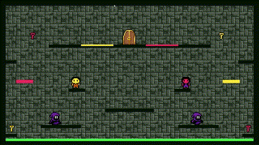
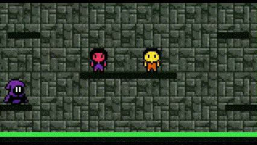
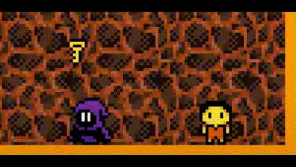
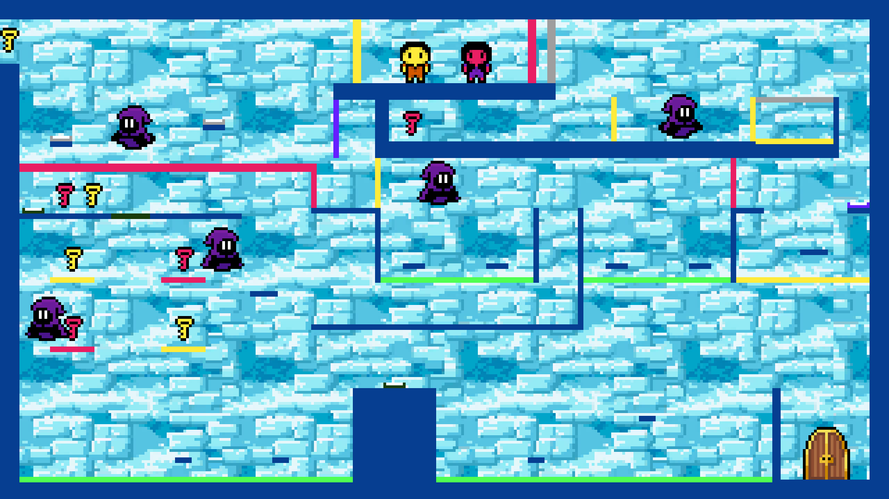

## 📖 Game Overview
__Dungeon Locked__ is a local co-op game inspired by the 00's Flash classic "Fireboy and Watergirl".  

In this game, two players take on the roles of our main characters, Lavena and Tergon, as they navigate through challenging dungeons filled with traps and enemies. To finally achieve freedom, they have to advance through 3 levels that require teamwork and strategy to overcome.  

In each level, the difficulty increases, introducing new challenges. In the final level, you'll face all the obstacles from the previous levels, along with a surprising new challenge that will push your abilities to the limit.

>

>This project was brought to life by António Lourenço Rodrigues (up202306331@up.pt), Gonçalo Santos (up202306340@up.pt) and Leandro Resende (up202306343@up.pt) for the LDTS 2024/25 curricular unit.
>

## 🏔️ Detailed Challenges and Obstacles

### Goal
In each level, the players' main objective is to collect all the keys that unlock the door, allowing them to move on to the next stage. Each player can only pick up the keys that correspond to their color, which adds an element of strategy and increases the challenge.

 

  <b><i>Gif 1 - When both players collect their keys, the door to the next level opens</i></b>

### Obstacles

#### Walls 🧱
The walls are the obstacles that make up the majority of the map. They serve as the main platforms, acting as the ground, walls, and ceiling of the level. These elements define the playable area, shaping the environment and providing level boundaries.

#### Traps 🪤
Traps are obstacles that players may or may not collide with, depending on their color. Players can only pass through traps that match their own color. If a trap is green, it targets both players, meaning neither player can walk over or touch it.

 

  <b><i>Gif 2 - Players can only touch traps that match their color</i></b>

 

  <b><i>Gif 3 - The green trap affects both players</i></b>

#### Enemies 🧙‍♂️
The only enemies in this game are the druids, small creatures that inhabit the caves (how did they come down here?). These druids wander around the dungeons, moving only horizontally, left to right. If a player comes into contact with a druid, they will die instantly. The only way to avoid them is by jumping over them or carefully coordinating your movement to bypass them safely.

 

  <b><i>Gif 4 - Player dies when he touches the monster and then respawns</i></b>

#### Toggleable Walls and Buttons 🖲️
While exploring a level, players may encounter a couple walls of different colors. These are toggleable walls! Unlike regular walls, toggleable walls can be deactivated using buttons.

For each toggleable wall, there must be at least one button of the same color. When a player presses the corresponding button, the toggleable wall becomes inactive and disappears. However, players must be cautious—if the button stops being pressed, the wall reappears. If a player is in the position of the wall when this happens, he will die instantly.

 

  <b><i>Gif 5 - Door disappears while the button is being pressed</i></b>

## 🎮 Gameplay Functionalities and Details

Number of Players: 2 (local co-op).

### Controls

####  __Tergon__ (Player 1)
Move Left: A  
Move Right: D  
Jump: W

#### __Lavena__ (Player 2)
Move Left: ←  
Move Right: →  
Jump: ↑  

## 🗺️ Levels

### Menu
Start a new game, select a specific level or exit the game.

### Tutorial

Basic layout and terrain to familiarize players with teamwork mechanics. Includes one of each obstacle, and their explanations.

 

### Level 1

Features more complex platforming, therefore harder parkour sections. Now there are also 2 keys for each player! 

 

### Level 2
This level requires even more team cooperation and precise jumping timing.

 

### Level 3
Complete Madness! Only the most skillful players will be up to the challenge!

 

### Credits
If you got here, congrats! Thank you for playing our game!

 

## 🚀 How to Play
Follow these steps:
* 1. Open a terminal and launch the game with `./gradlew run`
* 2. Use the menu to select a level, start from the tutorial or exit the game.
* 3. Work together to collect the keys and open the gate to complete the level.
* 4. Defeat the boss in the final level to win the game.

