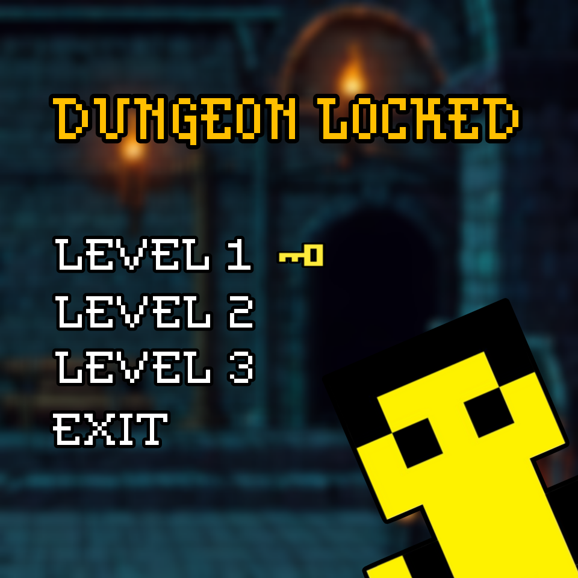

## 📖 Game Overview
__Dungeon Locked__ is a local co-op game inspired by the 00's Flash classic "Fireboy and Watergirl".  

In this game, two players take on the roles of our main characters, Lavena and Tergon, as they navigate through challenging dungeons filled with traps and enemies. To finally achieve freedom, they have to advance through 3 levels that require teamwork and strategy to overcome.  

In each level, the difficulty increases, introducing new challenges. In the final level, you'll face all the obstacles from the previous levels, along with a surprising new challenge that will push your abilities to the limit.

>

>This project was brought to life by António Lourenço Rodrigues (up202306331@up.pt), Gonçalo Santos (up202306340@up.pt) and Leandro Resende (up202306343@up.pt) for the LDTS 2024/25 curricular unit.
>

## Detailed Challenges and Obstacles

### Goal
In each level, the players' main objective is to collect all the keys that unlock the door, allowing them to move on to the next stage. Each player can only pick up the keys that correspond to their color, which adds an element of strategy and increases the challenge.

In the tutorial, all the game features are introduced and explained, and they will be progressively implemented in more complex ways as players advance through the levels:

### Obstacles

#### Walls 🧱
The walls are the obstacles that make up the majority of the map. They serve as the main platforms, acting as the ground, walls, and ceiling of the level. These elements define the playable area, shaping the environment and providing level boundaries.

#### Traps 🪤
Traps are obstacles that players may or may not collide with, depending on their color. Players can only pass through traps that match their own color. If a trap is green, it targets both players, meaning neither player can walk over or touch it.

#### Enemies 🧙‍♂️
The only enemies in this game are the druids, small creatures that inhabit the caves (how did they come down here?). These druids wander around the dungeons, moving only horizontally, left to right. If a player comes into contact with a druid, they will die instantly. The only way to avoid them is by jumping over them or carefully coordinating your movement to bypass them safely.

#### Toggleable Walls and Buttons 🖲️
While exploring a level, players may encounter a couple walls of different colors. These are toggleable walls! Unlike regular walls, toggleable walls can be deactivated using buttons.

For each toggleable wall, there must be at least one button of the same color. When a player presses the corresponding button, the toggleable wall becomes inactive and disappears. However, players must be cautious—if the button stops being pressed, the wall reappears. If a player is in the position of the wall when this happens, he will die instantly.

## 🎮 Gameplay Functionalities and Details

Number of Players: 2 (local co-op).

### Controls

####  __Tergon__ (Player 1)
Move Left: A  
Move Right: D  
Jump: W

#### __Lavena__ (Player 2)
Move Left: ←  
Move Right: →  
Jump: ↑  

## 🗺️ Features and Mechanics

### Menu
Start a new game, select a specific level or exit the game.

### Levels

In every level, the players' primary objective is to gather two keys that unlock the gate (black line), allowing them to progress to the next stage.
Each player can only pick up the key that matches their color, which enables the creation of more entertaining and challenging puzzles.
New levels gradually introduce new features, like:
* Environmental Obstacles: Toxic Lakes, platforms and walls.

* Enemies: Skeleton and Final Boss Skeleton.

* Traps and challenges: Toxic ponds and button-coordenated walls.

### Level 1 (Tutorial)

Basic layout and terrain to familiarize players with teamwork mechanics.

In Level 1, we decided to:
* Implement small parkour sections
* Introduce the players to the key feature
All of these features allow the new players to get familiar with the controls, mechanics and objectives of the game.

### Level 2

Features new enemies, platforms and toxic ponds.  

This level includes:
* More challenging parkour sections;
* Toxic ponds (which can only be touched by the character of the matching color);
* A new enemy, the skeleton, which moves exclusively sideways.
* Deaths: If the wrong player touches the toxic pond or any of them comes in contact with the monster, they will die instantly and respawn at the initial position.

### Level 3
Introduced new button obstacles and a bigger boss enemy.

This level introduces:
* A new button-coordenated purple wall, that disappears while one of the players is pressing the (also purple) button;
* A new enemy, the final boss, consisting of a bigger skeleton with a twist: this one stays still, only jumping vertically from time to time.

## 🚀 How to Play
Follow these steps:
* 1. Open a terminal and launch the game with `./gradlew run`
* 2. Use the menu to select a level, start from the tutorial or exit the game.
* 3. Work together to collect the keys and open the gate to complete the level.
* 4. Defeat the boss in the final level to win the game.

