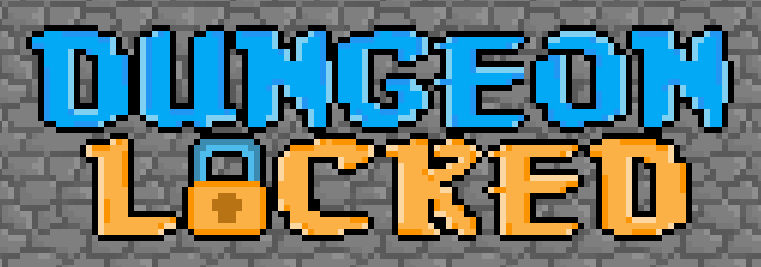
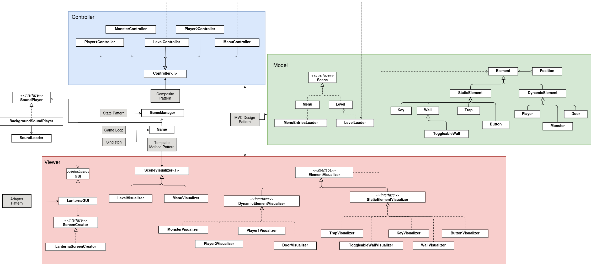
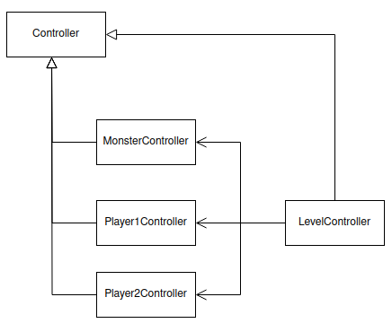
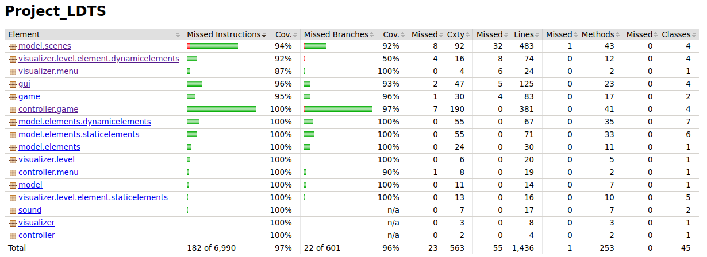
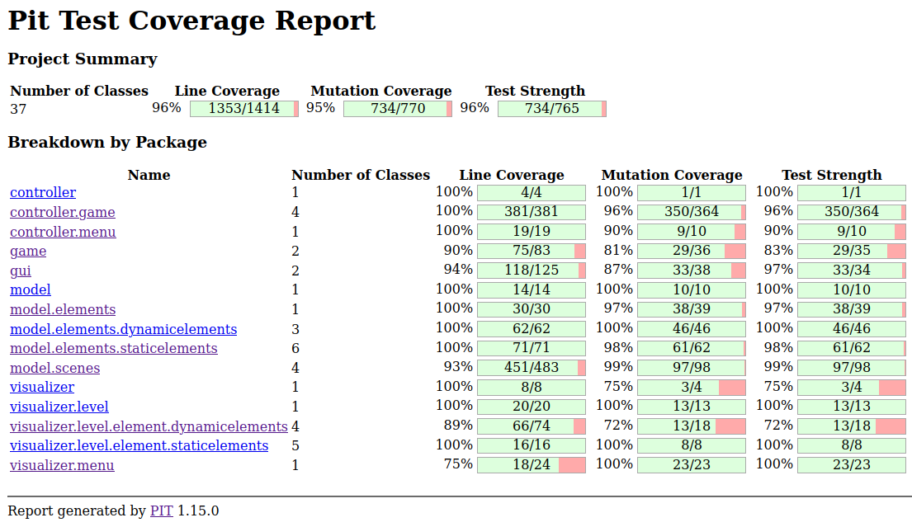

## 📖 Game Explanation
This file only deals with technical matters. To understand this game, please read its [explanation](../README.md).

>

>This project was brought to life by António Lourenço Rodrigues (up202306331@up.pt), Gonçalo Santos (up202306340@up.pt) and Leandro Resende (up202306343@up.pt) for the LDTS 2024/25 curricular unit.
>

## Table of Contents
- [Implemented Features](#implemented-features)
  - [Interactive Menu](#interactive-menu)
  - [Keyboard Actions Handling](#keyboard-actions-handling)
  - [Collision Detection](#colision-detection)
  - [Respawn](#respawn)
  - [Different Levels](#different-levels)
  - [Level-Ending Logics](#level-ending-logics)
- [Features and Mechanics](#-features-and-mechanics)
- [UML Class Diagram](#-uml-class-diagram)
- [Design Patterns](#-design-patterns)
  - [Singleton](#singleton)
  - [Composite](#composite)
  - [Adapter](#adapter)
  - [State](#state)
  - [Template Method](#template-method)
  - [Model-View-Controller](#model-view-controller-mvc)
  - [Game Loop](#game-loop)
- [Testing](#-testing)
- [Quality Assurance](#-quality-assurance)
- [Code Smells](#-code-smells)
- [Development](#-development)
- [Retrospective](#-retrospective)

## Implemented Features

### Interactive Menu
Upon launching the game, the user is presented with several options. They can begin with the tutorial, select a specific level to play, view the credits, or exit the game.

The currently highlighted option is indicated by a key on the left side, and the user can navigate through the menu using the up and down arrow keys. To confirm their selection, they simply press the Enter key.
### Keyboard Actions Handling
Key inputs are processed and translated into actions within the game. 

The controls for the two players are handled independently: Player 1 uses the WASD keys, while Player 2 uses the Arrow Keys. Additionally, pressing the Q key allows players to exit the current level and return to the main menu.

Multiple keyboard inputs can be processed per frame, enabling both players to move simultaneously and even in diagonal directions.

### Colision Detection
We implemented all the collision mechanics that seemed essential for our game. 

If a player collides with a monster, a trap, or is crushed by a toggleable wall, they will die instantly. Players cannot pass through walls but can move through each other and in front of the level's exit door, as intended.

### Respawn
If a player dies, they will respawn at their initial starting position from when the level first loaded. Upon respawning, any progress made up to that point will be reset, requiring the player to recollect all previously obtained keys.

### Different Levels
We implemented a tutorial and three distinct levels, each progressively more challenging.

### Level-Ending Logics
To advance to the next level, both players must reach the level's exit door. However, the door only opens once each player has collected all of their respective keys. Once this is achieved, both players must stand inside the doorframe to proceed to the next level.

### Animations 
The gameplay becomes more dynamic, fluid, and engaging through the use of sprites incorporated into some elements. These sprites adapt based on the element's orientation and state, adding a layer of interactivity and realism. 

This approach is applied to various game components, including the players, monsters, and doors, allowing them to respond visually to the player's actions and the game’s progress.

### Movement Physics
To ensure our game functions as intended, we implemented a physics mechanism that simulates gravity. This allows the players to jump and naturally return to the ground, creating a realistic and responsive movement system. 

### Fullscreen
To ensure optimal display settings, our game has the ability to automatically adjust the terminal and screen, switching to fullscreen mode. If your PC uses a 16:9 resolution, the game will automatically adapt the font size to fit the screen appropriately.

## 📈 UML Class Diagram

The following simplified UML diagram showcases classes and interfaces, as well as used design patters. Most dependencies were excluded because otherwise the diagram would be chaotic and unreadable.

For more details refer to:
[Complete Diagram](../assets/finalDelivery/CompleteUML.drawio.png)
## 🛠️ Design Patterns

### Creational Design Patterns

#### Singleton

* Justification: We also chose to apply the Singleton design pattern, which is implemented in the [Game](../src/main/java/game/Game.java) class.
  There’s really not a point in initiating more than one instance of the Game class. After all, we only want a single game running at once.

* Consequences: In order to implement this pattern, we made the Game class constructor private, and created a static method that manages its instances. This method checks if a Game already exists. If it does, that instance is returned, if not, a new instance is initialized.

### Structural Design Patterns

#### Composite
* Justification: Implementing the Composite Pattern came across as natural when implementing [LevelController](../src/main/java/controller/game/LevelController.java).
* Consequences: Due to the implementation of this design pattern we can treat individual controllers (like MonsterController, Player1Controller and Player2Controller) and the composite LevelController uniformly. By organizing controllers in this hierarchical way, we make our code cleaner and more intuitive.
  This pattern follows the Single Responsibility, the Open/Closed and the Liskov Substitution principles of SOLID, that help us make a modular system which is also easier to maintain.
* Diagram:

  

#### Adapter
* Justification: The adapter pattern gives more flexibility and adaptability to the code, while helping enforce the SOLID principles.
* Consequences: This pattern forces us to have more interfaces, like GUI, and to clearly define the responsibilities of each of its subclasses. Therefore, it helps us follow the SOLID principles, namely the Single Responsibility, Open/Closed and Interface segregation principles.
* Lanterna GUI and Level/Menu Loader: In our case, the class [LanternaGUI](../src/main/java/gui/LanternaGUI.java) acts as adapter between the Visualizers and Lanterna's functionalities. Lanterna GUI implements GUI, allowing for easy switching between GUI’s. In the future, we hope do a similar thing when loading levels: make an interface Level Loader, and several classes that implement it, allowing for several ways of representing levels.

### Behavioral Design Patterns

#### State
* Justification: In our game, there are only two possible states: Menu or Level. The behavior of the Controller and Visualizer class has to adapt depending on the current state.
  This design pattern also aligns with the Single Responsibility and Open/Closed principles of SOLID, which are great for our project. It organizes the code into distinct classes, each dedicated to a specific function, and enables the addition of new states without changing the existing ones.

* Consequences:This design pattern is implemented in our game through our GameManager class and Scene interface. The scene interface is implemented by the Menu and Level classes, which represent our only states. Then, everytime the game updates, the GameManager checks whether the current Scene is a Menu or a Level and adjusts its behavior accordingly.

#### Template Method

* Justification: The Template Method Pattern allows for defining a general structure for drawing scenes while enabling subclasses to customize specific steps, like drawing scene elements. This promotes code reuse, as the shared logic (clearing and refreshing the GUI) is centralized in the base class, reducing duplication and ensuring consistency across different visualizers. This aligns with the Single Responsibility, Open/Close, and Liskov substitution principles.
* Consequences: Using this pattern in our code improves code reusability and maintainability by centralizing the common drawing logic in the SceneVisualizer class while allowing customization through the drawElements method. It ensures consistent behavior across different visualizers and facilitates the addition of new scene types without modifying the core algorithm.

### Architectural Pattern

#### Model-View-Controller (MVC)
* Justification: Having a clear division of tasks among classes helps us follow the Single responsibility principle and allows dependency injection on tests. The three main responsibilities in a game are holding the state of the game, modifying it, and displaying it on an UI. Therefore, the most logical thing to do is to use the MVC pattern.
* Consequences: Using this method implies clearly separating the code in 3 parts, and holding an instance of each component in some of the classes. In our case, GameManager is the class that manages the interactions between them.

### Sequencing Pattern

#### Game Loop
* Justification: We decided to use this pattern because we don't really need to differentiate entities’ movement rates, and also to avoid synchronization errors between the threads. This pattern also ensures that the update and render processes happen in a consistent and smooth way. Additionally, it allows us to control the game's update rate, making it either smoother or lighter depending on our needs.
  This pattern can be broken down into five steps that repeat continuously. First, we initialize the game and set everything up for the start. Next, we process the user input, update the game objects, and draw all the elements. We then ensure updates occur at a steady rate using sleep, and the cycle repeats.
* Consequences: To implement this pattern, we created our Game class, which orchestrates the game's lifecycle (looping every 50ms) and maintains a controlled frame rate.
  This approach makes the game highly responsive and provides the player with a smooth and enjoyable experience, and we don't have any reason not to implement it in our project.
## 🏁 Testing
All the tests were developed using Spock, a testing platform based on the language Groovy. This platform was chosen over JUnit due to its simplicity and native mocking scheme.

Whenever suitable, dependency injection was used, allowing for better code and testing ease.

The final test suite achieved a 97% statement coverage and all classes were tested, as the following screenshot of a Jacoco report shows:

To assure the strength of tests, we used implemented mutation testing with Pit Test. We were able to kill 95% of mutations, and most of the remaining ones are not testable 
with Pit Test due to its inability to run tests that create GUI's. This forced us to create two test classes, each with one test, specifically to prevent Pit Test from running
those tests, since Pit Test doesn't support excluding tests.

## 💎 Quality Assurance

Although tests assure the quality of the output of the code, we felt like we needed to also assure the quality of the code itself. For that purpose, we used two additional tools.

### [Google's Error-Prone](https://github.com/google/error-prone)

Error-prone is a tool developed by google to catch common Java mistakes as compile-time errors. We included this tool early on in our project and all the errors it detects were solved.
Its configuration can be seen in this [file](../build.gradle).

### [JetBrains's Qodana](https://www.jetbrains.com/qodana/)

This tool allowed us to automatically detect unnecessary import statements, simplifiable if clauses, unnecessary semicolons and other code smells. 
The configuration for this tool can be seen at: [qodana config](../qodana.yaml).
## 🤢 Code Smells

Even though we used SOLID principles, used code analysis tools, and extensively tested our code, some other code smells remain, namely:
- Long switch statements are still present in [LanternaGUI](../src/main/java/gui/LanternaGUI.java).
- Chained if-else-if statements are used in controllers of [player 1](../src/main/java/controller/game/Player1Controller.java) and [player 2](../src/main/java/controller/game/Player2Controller.java).
- The controllers of player [1](../src/main/java/controller/game/Player1Controller.java) and [2](../src/main/java/controller/game/Player2Controller.java) are almost duplicated code, since the only difference between them is that player 1 moves with arrows and player2 moves with WASD.
- In some places, like the [visualizer of the level-ending door](../src/main/java/visualizer/level/element/dynamicelements/DoorVisualizer.java), the `get` method may throw unhandled exceptions if the code is carelessly changed.
- Some classes, like [ToggleableWallVisualizer](../src/main/java/visualizer/level/element/staticelements/ToggleableWallVisualizer.java) are at the frontier of acceptable name length.

## 🤝 Development

To further improve and guarantee the quality of the software, we use additional tools, namely branch protection on `master` via [Github Actions](https://github.com/features/actions), and peer reviews on every pull request to that branch.

All pull requests to the branch `master` must pass a [Github Action](../.github/workflows/test.yml) that compiles the code and runs unit tests from all classes that don't require GUI creation.

To protect the `master` branch and ensure no code breaks it, we also enforce a set of rules that, among other things requires pull requests with 2 approving reviews to be merged.

We use feature and fix branches, and common naming conventions on branches and commits.

## 🔙 Retrospective

All proposed features were implemented, except for PowerUps, because we felt like that didn't make sense in the context of our game.
